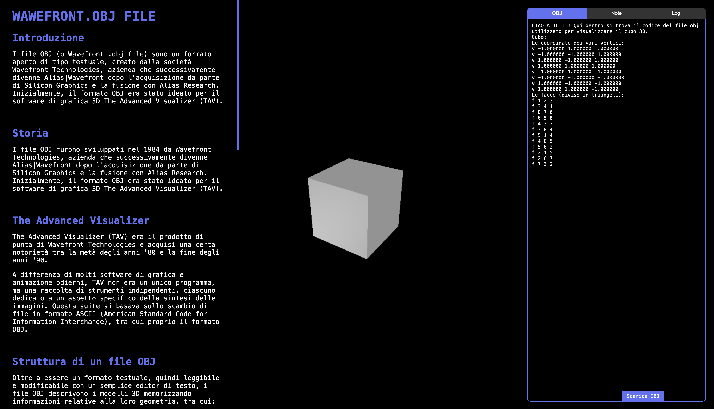
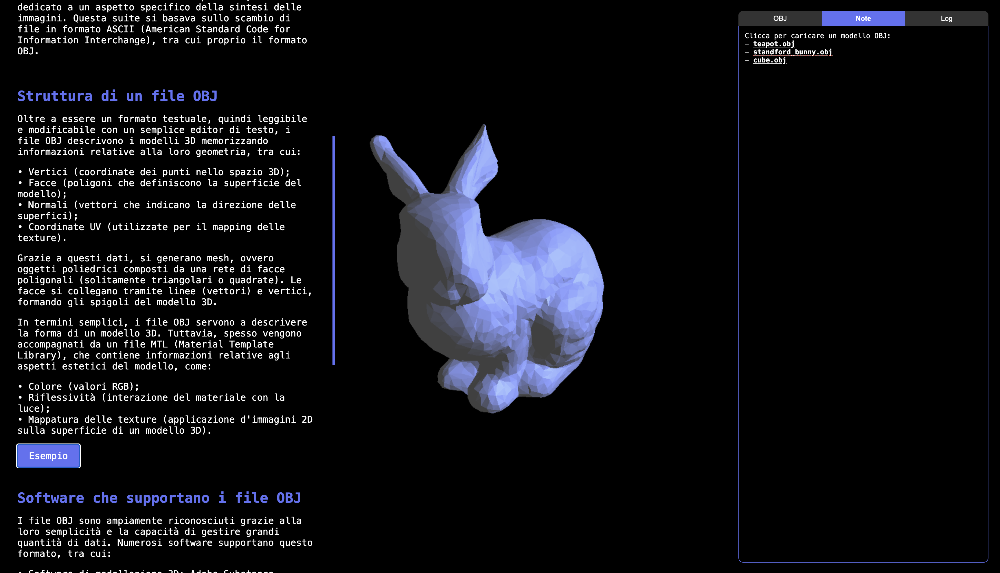
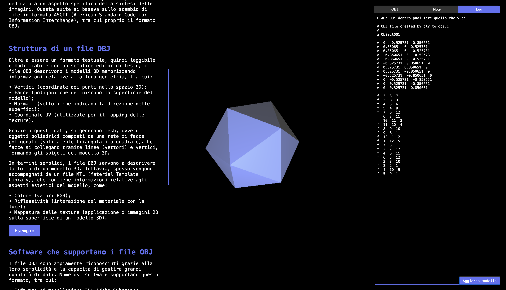

SUPSI 2025  
Corso d’interaction design, CV429 
Docenti: A. Gysin, G. Profeta 

Elaborato 2: Creazione di un sito Internet con interazioni

# Wawefront Obj File
Autore: Anastasia Wiesendanger 
[Wawefront Obj File](https://anastasiawiesendanger.github.io/The_Wawefront.obj_file/)


## Introduzione e tema
Per questo lavoro, tutti gli studenti che frequentano il corso di "Interaction Design" e che appartengono al corso di laurea del Bachelor in Comunicazione visiva, hanno dovuto realizzare un sito internet che descrivesse un "oggetto" digitale specifivo. Nel mio caso l'bj file, più specifico "Wawefront obj file". Il modo in cui dovevamo rappresentare il sito, era alquanto libero. Avevamo pochi punti principali da rispettare, ovverro: il sito deve rappresentare un singolo articolo riguardo l'argomento che ci è stato assegnato, all'interno di una singola pagina e con presententi alcune animazioni interattive


## Riferimenti progettuali
Una delle prime cose che ho fatto, è stato (oltre che a scrivere l'articolo) di trovare un file obj e cercare di aprirlo per vedere come il modello 3D appariva. Visto che questo argomento è nuovo per me, ho deciso di partire da un file obj contenente una figura molto semplice, il cubo. Per vedere se il file avrebbe rappresentato la figura in modo corretto, ho deciso di visualizzarlo velocemente tramite il 3D software Blender.


https://github.com/user-attachments/assets/3ca10ae4-5bdb-4daa-bd36-88e29415e1f0

Il cubo come si può vedere nel video appare all'interno della schermata. Decido di girare la telecamera all'interno dell'applicazione per vedere tutto il modello. Da questa semplice interazione con il cubo all'interno dell'applicazione, decido di utilizzarla come punto di inspirazione per il mio progetto. Dare alla persona/utente che visita il sito la possibilità di visualizzare un modello 3D, non solo dal fronte, ma in tutte le direzioni, una visione a 360 gradi. In seguito deciderò anche di mettere lo zoom, cosa che si puo fare anche in Blender.

## Design dell’interfraccia e modalità di interazione
L'interfaccia in se è stata elaborata affinché tu possa trovare tutto (sia informazioni che le animazioni) all'interno di una singola pagina. Lo sfondo nero è stato scelto affinché il modello 3D possa risultare più evidente sul background, stessa cosa vale per il testo. l'oggetto tridimensionale lo puoi osservare da varie angolazioni semplicemente cliccando, tenendo premuto il mouse e trascinandolo. Puoi anche osservarlo sia da lontano che da vicino per osservare meglio la sua forma. Per far si che tu possa guardare l'oggetto 3D anche in grande dimesioni, il testo è stato fatto senza uno sfondo dietro di se, così che si possa vedere l'oggetto anche dietro le scritte.

Un'altra interazione interessante, riguarda il riquadro che si trova a destra. Vi sono tre sezioni al suo interno: una in cui visualizzi il codice del modello 3D (codice) e volendo scaricarlo cliccando "scarica", una in cui poi cambiare e scegliere un altro file obj (file OBJ), mentre l'ultima poi inserire da te un codice obj differente (Play) e per visualizzarlo bisogna cliccare "Aggiorna modello".

[]()
[]() 
[]()

All'interno della sezione "codice" poi inoltre visualizzare i vertici e le facce corrispondenti alla parte di codice in cui fai mouse hover. Funziona bene per i vertici ma non così tanto per le facce.


## Tecnologia usata
Per questo lavoro, non essendo esperta in codice, specialmente per quanto riguarda la creazione di animazioni interattive, mi sono fatta aiutare da Chat GPT e DeepSeek (e un pochino da BLACKBOX.AI). Mentre un sito che è stato di grande aiuto per la creazione dei file obj e mtl è stata la libreria del congresso, ovvero "Library of congress". Oltre che ad esserci una spiegazione dettaglia riguardo l'Obj file ci sono anche presenti dei codici d'esempio al riguardo che ho utilizzato per la creazione di alcune cose presenti nell'articolo:


```g Object001

v -1.000000 1.000000 1.000000
v -1.000000 -1.000000 1.000000
v 1.000000 -1.000000 1.000000
v 1.000000 1.000000 1.000000
v -1.000000 1.000000 -1.000000
v -1.000000 -1.000000 -1.000000
v 1.000000 -1.000000 -1.000000
v 1.000000 1.000000 -1.000000

f 1 2 3 4
f 8 7 6 5
f 4 3 7 8
f 5 1 4 8
f 5 6 2 1
f 2 6 7 3
```

Questo codice rappreseta un modello 3D, più precisamente un cubo ed è composto da vertci (es. v -1.000000 1.000000 1.000000 ) e facce (es. f 1 2 3 4).


## Target e contesto d’uso
Questo articolo è stato principalmente crearto con l'intenzione di essere mostrato/visto agli studenti che frequentano il Bachelor di Comunicazione Visiva, più specificamente per chi frequenta o vorrà frequentare la classe di Interaction Design. L'articolo in sè ha lo scopo principale di essere una fonte di informazione, di incuriosire, oltre che ha mostrare le varie interazioni che si possono creare al'interno di un file html tramite il codice ed invogliare la gente a restare un po' più a lungo sulla pagina. 
